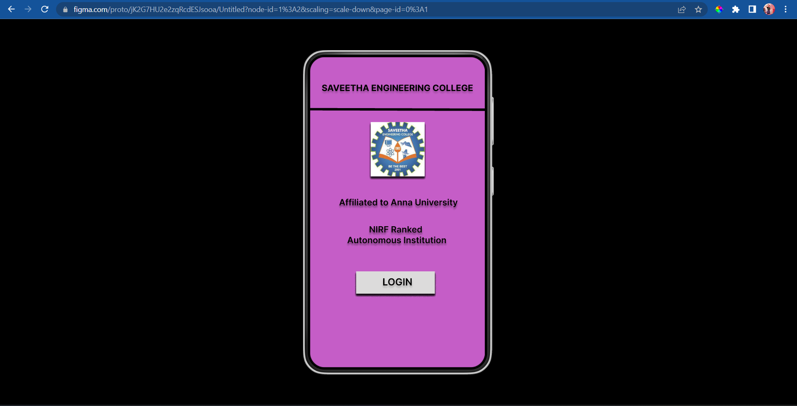
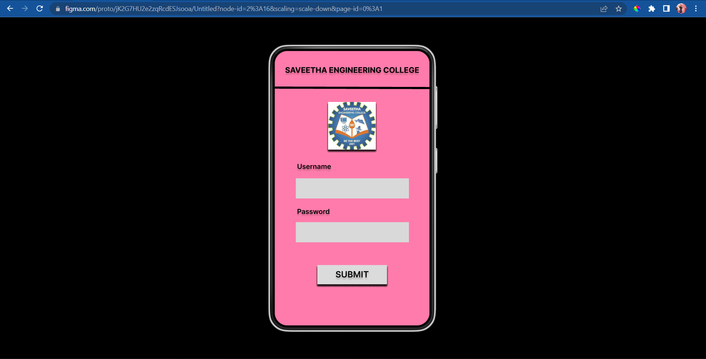
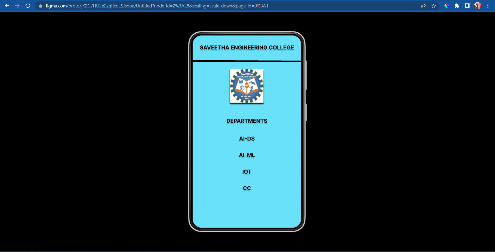

# Event Registration Web Application

## AIM:
To design, develop and deploy a web application for event registration.

## DESIGN STEPS:

### Step 1:
Create a new frame.

### Step 2:
Select any one preset size of your choice.

### Step 3:
Select the shapes you need.

### Step 4:
Inport images as needed.

### Step 5:
Create pages based on your need and link them.
### Step 6:

Validate the HTML and CSS code.

### Step 6:

Publish the website in the given URL.

## DESIGN TOOL:
Figma

## PROGRAM :
```css
/* Home Page */
position: relative;
width: 360px;
height: 640px;
background: #C55DC7;

/* Login Page */
position: relative;
width: 360px;
height: 641px;
background: #FF7BAB;

/* SAVEETHA ENGINEERING COLLEGE */
position: absolute;
width: 328px;
height: 35px;
left: 16px;
top: 29px;
font-family: 'Inter';
font-style: normal;
font-weight: 700;
font-size: 18px;
line-height: 22px;
text-align: center;
color: #000000;
text-shadow: 0px 4px 4px rgba(0, 0, 0, 0.25);

/* DEPARTMENTS */
position: absolute;
width: 328px;
height: 35px;
left: 16px;
top: 273px;
font-family: 'Inter';
font-style: normal;
font-weight: 700;
font-size: 18px;
line-height: 22px;
text-align: center;
color: #000000;
text-shadow: 0px 4px 4px rgba(0, 0, 0, 0.25);

/* AI-DS */
position: absolute;
width: 328px;
height: 35px;
left: 16px;
top: 332px;
font-family: 'Inter';
font-style: normal;
font-weight: 700;
font-size: 18px;
line-height: 22px;
text-align: center;
color: #000000;
text-shadow: 0px 4px 4px rgba(0, 0, 0, 0.25);

/* AI-ML */
position: absolute;
width: 328px;
height: 35px;
left: 16px;
top: 387px;
font-family: 'Inter';
font-style: normal;
font-weight: 700;
font-size: 18px;
line-height: 22px;
text-align: center;
color: #000000;
text-shadow: 0px 4px 4px rgba(0, 0, 0, 0.25);

/* IOT */
position: absolute;
width: 328px;
height: 35px;
left: 16px;
top: 442px;
font-family: 'Inter';
font-style: normal;
font-weight: 700;
font-size: 18px;
line-height: 22px;
text-align: center;
color: #000000;
text-shadow: 0px 4px 4px rgba(0, 0, 0, 0.25);

/* CC */
position: absolute;
width: 328px;
height: 35px;
left: 16px;
top: 497px;
font-family: 'Inter';
font-style: normal;
font-weight: 700;
font-size: 18px;
line-height: 22px;
text-align: center;
color: #000000;
text-shadow: 0px 4px 4px rgba(0, 0, 0, 0.25);

/* Rectangle 2 */
position: absolute;
width: 263px;
height: 47px;
left: 49px;
top: 297px;
background: #D9D9D9;

/* SEC logo 4 */
position: absolute;
width: 111px;
height: 111px;
left: 124px;
top: 119px;
background: url(SEC logo.jpg);
box-shadow: 0px 4px 4px rgba(0, 0, 0, 0.25), 0px 4px 4px rgba(0, 0, 0, 0.25), 0px 4px 4px rgba(0, 0, 0, 0.25), 0px 4px 4px rgba(0, 0, 0, 0.25), 0px 4px 4px rgba(0, 0, 0, 0.25), 0px 4px 4px rgba(0, 0, 0, 0.25), 0px 4px 4px rgba(0, 0, 0, 0.25);

/* Auto layout */
display: flex;
flex-direction: column;
align-items: flex-start;
padding: 0px;
position: relative;
visibility: hidden;
width: 115.8px;
height: 247.2px;

/* Line 1 */
position: absolute;
width: 360px;
height: 1px;
left: 0px;
top: 110px;
border: 5px solid #000000;
transform: rotate(0.16deg);

/* SEC Page */
position: relative;
width: 360px;
height: 641px;
background: #6AE1FB;

```
## OUTPUT:

<br>


<br>


<br>

## Result:
The program to design, develop and deploy a web application for event registration is completed successfully.

